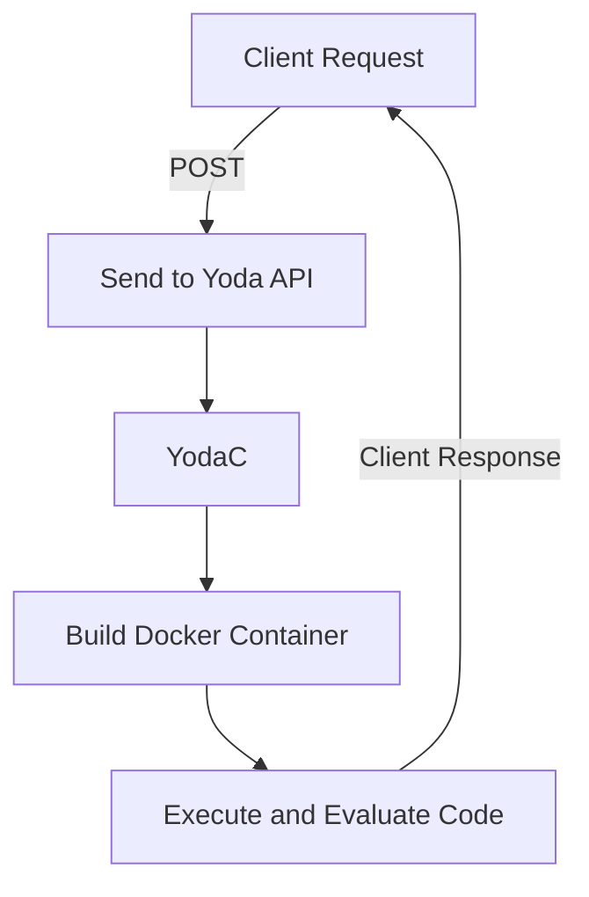

# Yoda
## Compile and evaluate programs in OCaml

## 📝 Description
This project is composed of YodaB and YodaC

### YodaB 
Module responsible of api and aims to reduce feedback time, improve consistency in grading, provide analytical data on students’ individual and collective performance, and create a secure and scalable foundation for future integrations with academic systems or online learning platforms.

### YodaC 
Module responsible for compiling and executing program code in a controlled manner, ensuring security and resource limitations. The system will integrate compilers and interpreters for different programming languages and execute the code in an isolated environment (sandbox), preventing unauthorized access to the host system.

## 🔧 How It Works

**Workflow Overview:**

