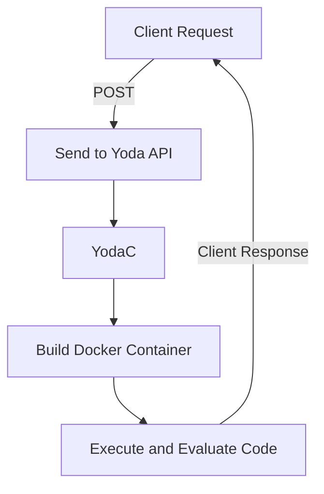

# project
## WebAssembly para monitorização eficiente de aplicações web
Compile and evaluate programs in OCaml

## 📝 Description
Este projeto insere-se na utilização de WebAssembly (WASM) para o desenvolvimento de mecanismos de monitorização eficientes para aplicações web. A base do desenvolvimento é o Ocapi (disponível em https://github.com/anmaped/ocapi), uma aplicação web composta por um front-end e uma API REST capaz de compilar, de forma segura, programas OCaml para WebAssembly através da utilização de containers. Atualmente, o Ocapi aceita programas de monitorização gerados automaticamente pela ferramenta rmtld3synth (disponível em https://github.com/anmaped/rmtld3synth), desde que estes sejam produzidos em OCaml. O objetivo principal do projeto é permitir a simulação e execução, diretamente no browser, de monitores gerados automaticamente em C++11 pelo rmtld3synth, através da sua compilação para WebAssembly. Desta forma, torna-se possível executar, simular e comparar diferentes monitores num ambiente web, sem dependência de infraestrutura nativa, promovendo uma maior interatividade e melhores capacidades de visualização do sistema de monitorização. Plano de trabalho: Compilação de monitores em C++11 para WebAssembly; Integração dos binários WASM na aplicação web de demonstração existente (disponível em https://ocaml.di.ubi.pt/ocapi/), permitindo a sua execução e visualização no browser; Avaliação do desempenho dos monitores em WebAssembly em comparação com as implementações nativas e em OCaml; Por fim, idealmente, construção de um running example com foco em dispositivos ciberfísicos.

## 🔧 How It Works

**Workflow Overview:**

