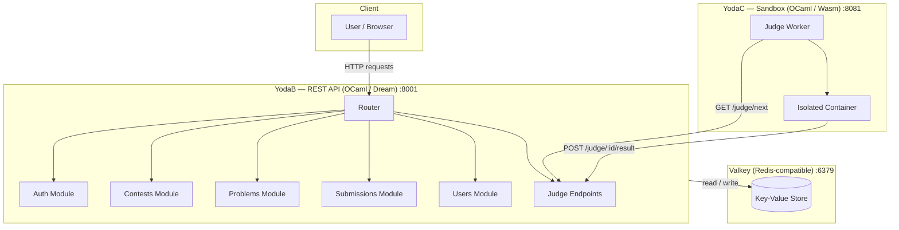
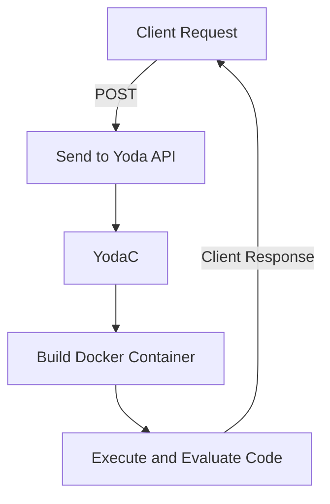
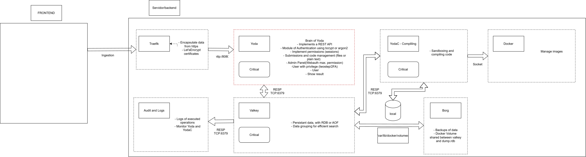

# Yoda

## Compile and evaluate programs in OCaml


[](https://github.com/pedrocasais/yoda/actions/workflows/build.yml)
[](https://github.com/pedrocasais/yoda/actions/workflows/build-sandbox.yml)


## 📝 Description
This repository is composed of YodaB and YodaC.

### YodaB
Module responsible for the API. It aims to reduce feedback time, improve consistency in grading, provide analytical data on students' individual and collective performance, and create a secure and scalable foundation for future integrations with academic systems or online learning platforms.

### YodaC
Module responsible for compiling and executing program code in a controlled manner, ensuring security and resource limitations. The system integrates compilers and interpreters for different programming languages and executes code in an isolated environment (sandbox), preventing unauthorized access to the host system.

## 🏗️ System Architecture

The platform is split into three main components:
- Client-facing API service (YodaB)
- Judge/sandbox execution service (YodaC)
- Persistent state storage (Valkey)


```mermaid
graph TB
  subgraph Client
    U[User / Browser]
  end

  subgraph YodaB ["YodaB — REST API (OCaml / Dream) :8001"]
    R[Router]
    AUTH[Auth Module]
    CONT[Contests Module]
    PROB[Problems Module]
    SUB[Submissions Module]
    USR[Users Module]
    JDG[Judge Endpoints]
    R --> AUTH & CONT & PROB & SUB & USR & JDG
  end

  subgraph Store ["Valkey (Redis-compatible) :6379"]
    DB[(Key-Value Store)]
  end

  subgraph YodaC ["YodaC — Sandbox (OCaml / Wasm) :8081"]
    POLL[Judge Worker]
    EXEC[Isolated Container]
    POLL --> EXEC
  end

  U -- "HTTP requests" --> R
  YodaB -- "read / write" --> DB
  POLL -- "GET /judge/next" --> JDG
  EXEC -- "POST /judge/:id/result" --> JDG
```

## 🔧 Workflow

Submission lifecycle overview:
- The client sends requests to YodaB.
- YodaB stores and manages data in Valkey.
- YodaC fetches pending submissions, executes them in isolation, and reports results back.


```mermaid
flowchart TD
  A[Client Request] -->| POST | B[Send to Yoda API]
  B --> C[YodaC]
  C --> D[Build Docker Container]
  D --> E[Execute and Evaluate Code]
  E --> |Client Response| A
```

## 📦 Container Images

Pre-built images are published to the GitHub Container Registry on every push to `main` and on each release.

| Image | Description |
|-------|-------------|
| `ghcr.io/pedrocasais/yoda-b` | YodaB — REST API server |
| `ghcr.io/pedrocasais/yoda-c` | YodaC — Compiler & judge sandbox |

**Pull the latest images:**

```bash
docker pull ghcr.io/pedrocasais/yoda-b:master
docker pull ghcr.io/pedrocasais/yoda-c:master
```

**Pull a specific release:**

```bash
docker pull ghcr.io/pedrocasais/yoda-b:1.0.0
docker pull ghcr.io/pedrocasais/yoda-c:1.0.0
```

## ⚙️ Infrastructure Architecture
